# Flutter - Staff Management System
- The purpose of this application is to enable the personnel working in the same workplace to divide the work among them and to communicate with each other.
- I created [Mocki](https://mocki.io/fake-json-api) Fake API from a site and used it in my project.

## Pages
- <a href ='#Login Page'> Login Page </a>
- <a href ='#Panel Page'> Panel Page </a>
- <a href ='#Job Pool Page'> Job Pool Page </a>
- <a href ='#My Job Pool Page'> My Job Pool Page </a>
- <a href ='#Job Pool Detail Page'>Job Pool Detail Page</a>
- <a href ='#New Job Page'> New Job Page </a>

## Features
- Made with Dio library, BLoC Provider, MVVM Architecture...

 

### Login Page

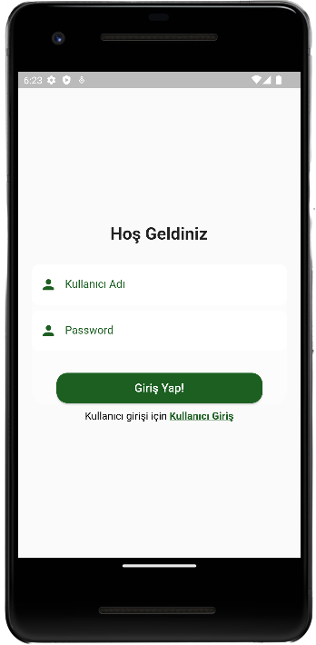 

### Panel Page

  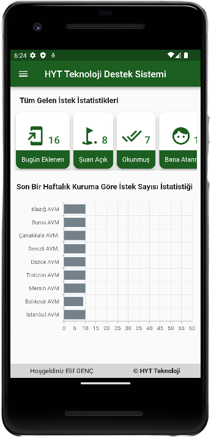
&nbsp; &nbsp; &nbsp; &nbsp;
  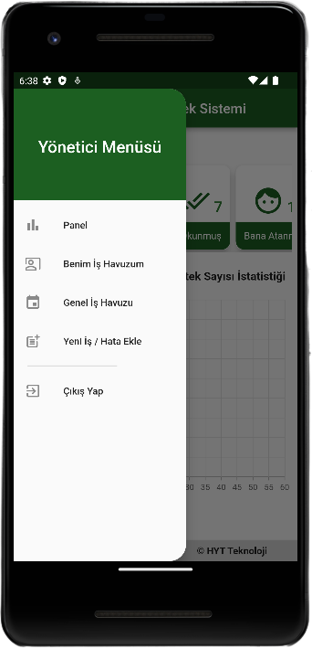

### Job Pool Page

  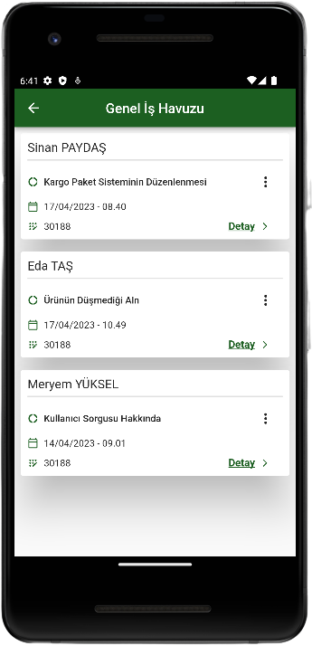
&nbsp; &nbsp; &nbsp; &nbsp;
  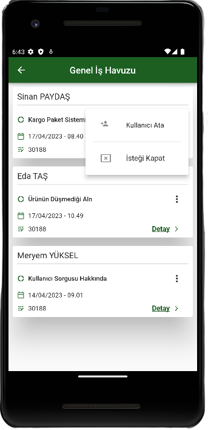
  &nbsp; &nbsp; &nbsp; &nbsp;
  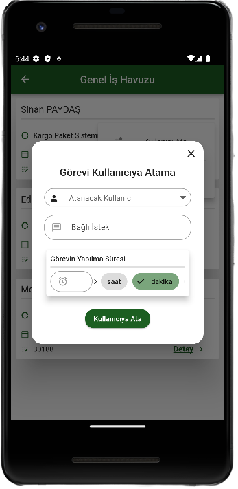

### My Job Pool
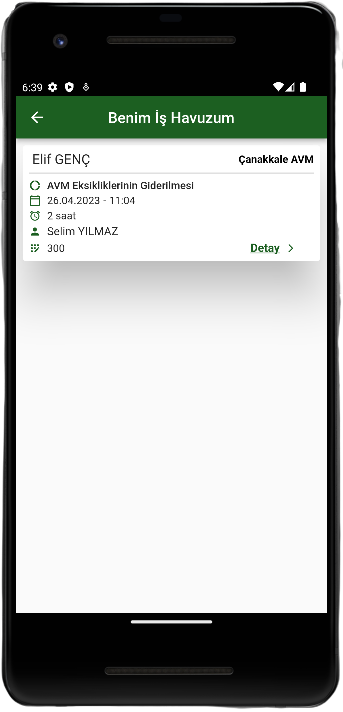 

### Job Detail Page

  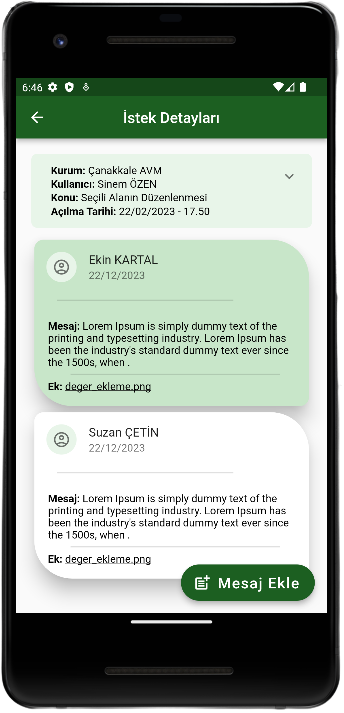
&nbsp; &nbsp; &nbsp; &nbsp;
  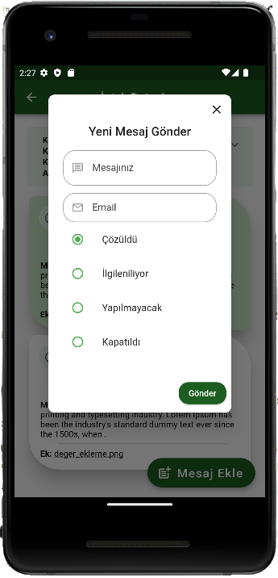

### New Job Page

  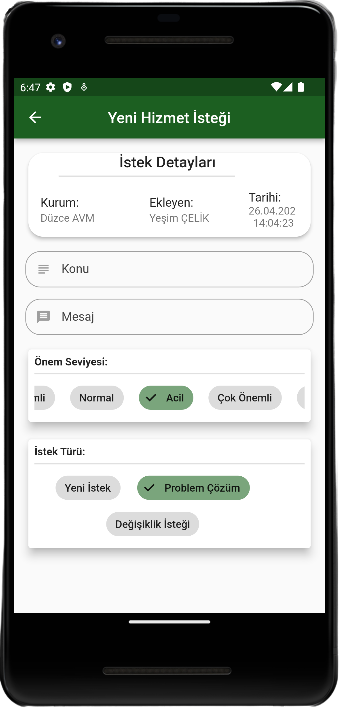
&nbsp; &nbsp; &nbsp; &nbsp;
  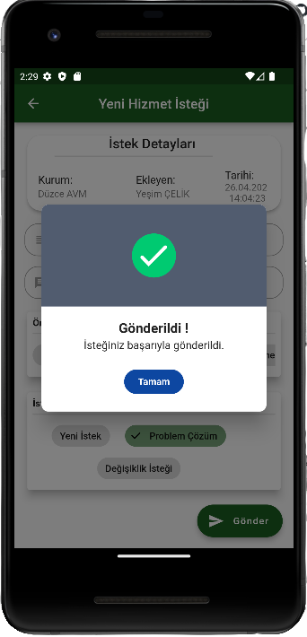

